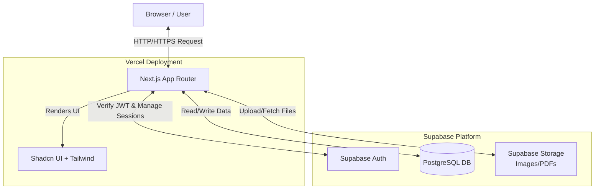
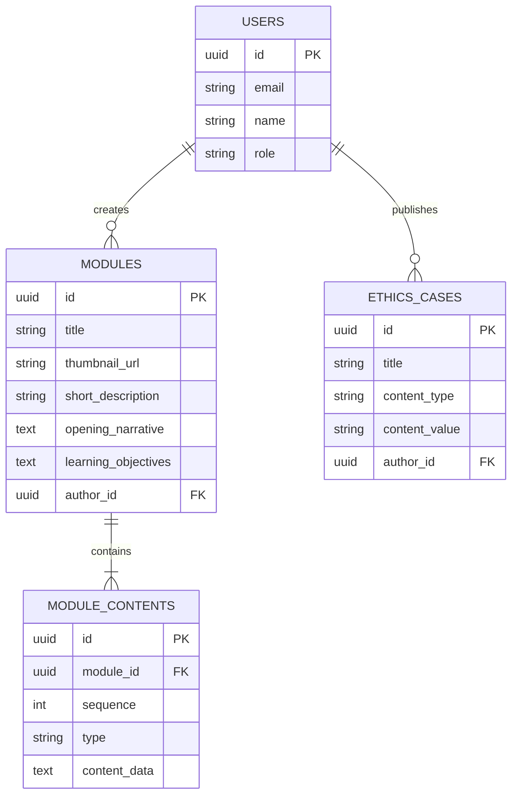

# PRD — Project Requirements Document

## 1. Overview
**Bio-Gen Learn** adalah sebuah platform web *Learning Management System* (LMS) dinamis yang dirancang khusus untuk memfasilitasi pembelajaran biologi/genetika dan studi kasus etika terkait. Masalah yang sering dihadapi dalam pembelajaran konvensional adalah materi yang statis dan kurangnya update terhadap kasus-kasus nyata. Aplikasi ini bertujuan menyajikan materi pembelajaran dalam berbagai format multimedia (teks, gambar, embed YouTube, link) secara berurutan, serta menyediakan ruang bagi guru (Admin) untuk memberikan pembaruan mengenai kasus-kasus etika terbaru kepada para siswa. 

## 2. Requirements
1. **Sistem Autentikasi Dual-Role**: Memisahkan akses antara Siswa (bisa mendaftar sendiri) dan Admin/Guru (akun dibuat oleh Super Admin).
2. **Fleksibilitas Konten (Multi-format)**: Sistem harus mampu merender konten materi yang terdiri dari kombinasi berbagai tipe media (paragraf teks, gambar, embed video YouTube, tautan, PDF) dalam satu halaman modul secara berurutan.
3. **Pengelolaan Kasus Etika**: Sistem harus memiliki fitur di mana Admin dapat mengunggah atau menautkan berita/kasus etika terbaru (dalam bentuk teks, PDF, atau link luar) yang langsung tampil di Dashboard Siswa.
4. **Tanpa Pelacakan Progres (No Tracking)**: Sesuai kebutuhan, saat ini siswa dapat mengakses semua materi berulang kali secara bebas tanpa fitur *progress tracking*.
5. **Standar Pengembangan**: Wajib menggunakan **Next.js terbaru**, komponen **shadcn/ui**, **Supabase CLI** untuk manajemen database secara lokal dan remote, serta wajib menggunakan/membaca referensi "Context 7" sebelum mengeksekusi pembuatan fitur di tahap *development*.

## 3. Core Features
*   **Autentikasi & Otorisasi**
    *   **Login**: Halaman masuk terpusat untuk Admin dan Siswa.
    *   **Register Siswa**: Halaman pendaftaran khusus untuk Siswa baru. (Akun Admin hanya dibuat dari sisi *backend* / Super Admin).
*   **Dashboard Siswa**
    *   **Header Welcoming**: Menampilkan sapaan "Selamat datang, [Nama Siswa]".
    *   **Card Modul Highlight**: Menampilkan daftar modul unggulan yang berisi *Thumbnail*, Judul, Deskripsi Singkat, dan tombol "Mulai Belajar".
    *   **Update Kasus Etika Baru**: Akses cepat ke bacaan, tautan, atau dokumen PDF berisi isu dan berita etika genetika/biologi terbaru.
*   **Halaman Detail Modul**
    *   **Narasi Pembuka**: Teks pembuka berupa pengantar atau berita kontekstual dari guru.
    *   **Tujuan Belajar**: Informasi poin-poin capaian pembelajaran modul.
    *   **Koleksi Materi Inti**: Area pembelajaran utama di mana konten disusun secara fleksibel oleh guru per *blok/section* (misal: Blok 1 Teks, Blok 2 Video YouTube, Blok 3 Gambar, Blok 4 Link Referensi luar).
*   **Admin/Teacher CMS (Tersirat dari fungsi aplikasi)**
    *   Halaman internal (hanya bisa diakses guru) untuk membuat modul, menyusun blok materi multi-format, dan memposting kasus etika baru.

## 4. User Flow
1. **Siswa Baru**: Mengunjungi situs -> Akses halaman Register -> Mengisi data (Nama, Email, Password) -> Berhasil masuk ke Dashboard.
2. **Siswa Terdaftar**: Mengunjungi situs -> Akses halaman Login -> Masuk ke Dashboard -> Membaca *Update Kasus Etika* atau mengklik "Mulai Belajar" pada *Card Modul* -> Masuk ke Detail Modul -> Membaca Narasi & Tujuan -> Mengakses Materi Inti berurutan ke bawah.
3. **Admin (Guru)**: Diberikan akun oleh Super Admin -> Halaman Login -> Masuk ke Dashboard Admin -> Memasukkan data modul baru/kasus etika baru -> Publikasi.

## 5. Architecture
Aplikasi ini menggunakan pendekatan *Serverless Fullstack*. Next.js bertindak sebagai *Frontend* dan *Backend API layer*. Autentikasi dan *Database* diurus sepenuhnya oleh Supabase menggunakan konektivitas aman, sementara seluruh web di-deploy di infrastruktur Vercel.

## 6. Database Schema
Struktur data difokuskan pada relasi antara Pengguna (Siswa/Guru), Modul Pembelajaran, Blok Konten di dalam Modul (untuk mendukung multi-format), dan Berita Kasus Etika.

### Daftar Tabel Utama:
*   **`users`**: Menyimpan profil pengguna. 
    *   `id` (UUID, Primary Key)
    *   `email` (String)
    *   `name` (String, digunakan untuk "Selamat datang, [Nama]")
    *   `role` (Enum: 'admin', 'student')
*   **`ethics_cases`**: Menyimpan *Update Kasus Etika Baru*.
    *   `id` (UUID, Primary Key)
    *   `title` (String)
    *   `content_type` (Enum: 'text', 'pdf', 'link')
    *   `content_value` (String, berisi URL tujuan atau teks panjang)
    *   `author_id` (UUID, Foreign Key ke `users`)
*   **`modules`**: Menyimpan *header* dan informasi umum Modul Pembelajaran.
    *   `id` (UUID, Primary Key)
    *   `title` (String)
    *   `thumbnail_url` (String)
    *   `short_description` (String)
    *   `opening_narrative` (Text, untuk Narasi Pembuka)
    *   `learning_objectives` (Text, untuk Tujuan Belajar)
    *   `author_id` (UUID, Foreign Key ke `users`)
*   **`module_contents`**: Menyimpan blok-blok materi inti (Mendukung multi-format di dalam satu modul).
    *   `id` (UUID, Primary Key)
    *   `module_id` (UUID, Foreign Key ke `modules`)
    *   `sequence` (Integer, urutan tampil blok)
    *   `type` (Enum: 'text', 'image', 'youtube', 'link')
    *   `content_data` (Text, berisi nilai sesuai *type* misalnya elemen paragraf atau ID YouTube)

### Entity-Relationship Diagram (ERD):

## 7. Tech Stack
*   **Framework Aplikasi**: Next.js (Versi terbaru, menggunakan *App Router*).
*   **Komponen UI**: shadcn/ui.
*   **Styling**: Tailwind CSS.
*   **Backend & Database**: Supabase (PostgreSQL), diintegrasikan dan dikelola pembangunannya secara lokal menggunakan **Supabase CLI**.
*   **Autentikasi**: Supabase Auth (Email & Password).
*   **Penyimpanan File**: Supabase Storage (Untuk thumbnail gambar & file PDF untuk kasus etika).
*   **Hosting / Deployment**: Vercel.
*   **Development Rules**: **Wajib menggunakan dan memuat *Context 7*** setiap kali akan mengeksekusi atau membuat perancangan fitur baru di level *codings*.